

  

<h1 align="center">Portfolio</h1>

  <a href="https://chapelin.com.br/"><strong>new tech, new me</strong></a>
   
  chapelin.com.br

  
  
  
  
  

  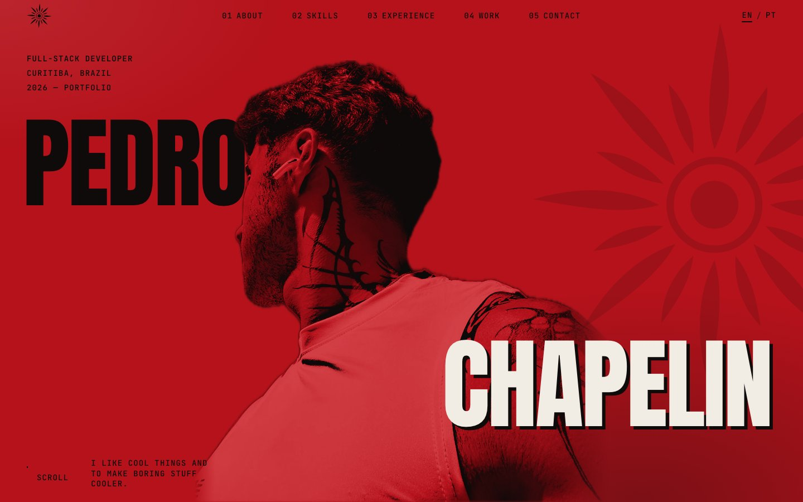

  

## Desktop

<table>
  <tr>
    <td>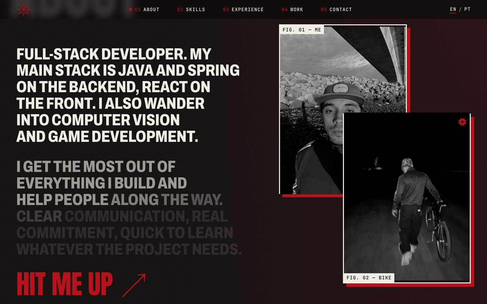</td>
    <td>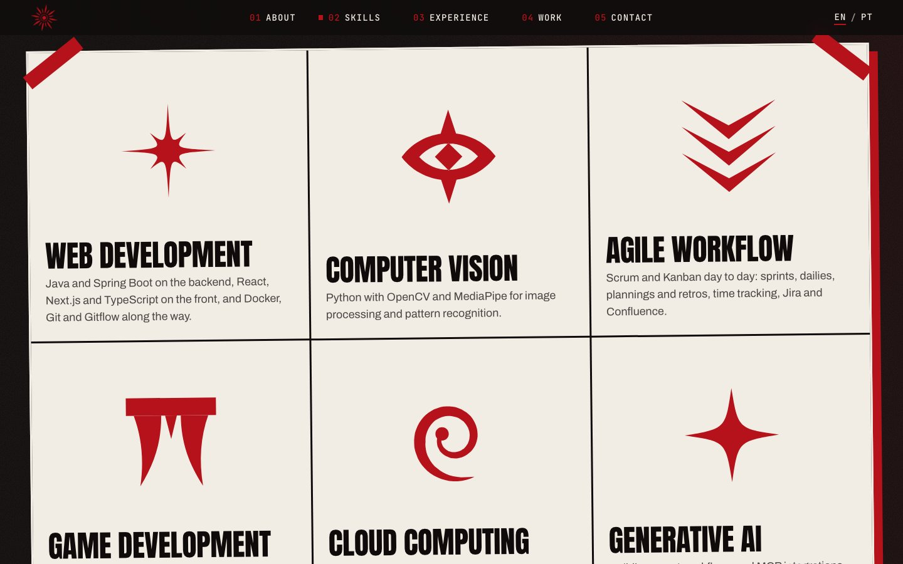</td>
  </tr>
  <tr>
    <td align="center">01 — About</td>
    <td align="center">02 — Skills</td>
  </tr>
  <tr>
    <td>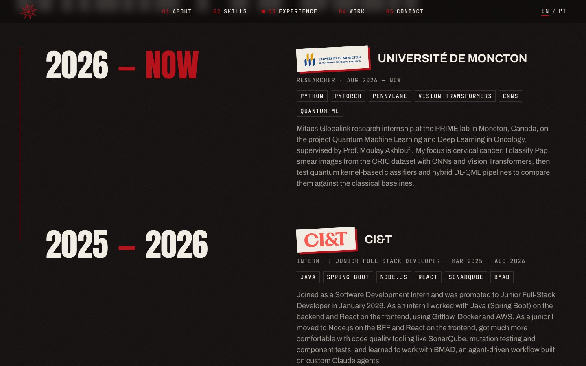</td>
    <td>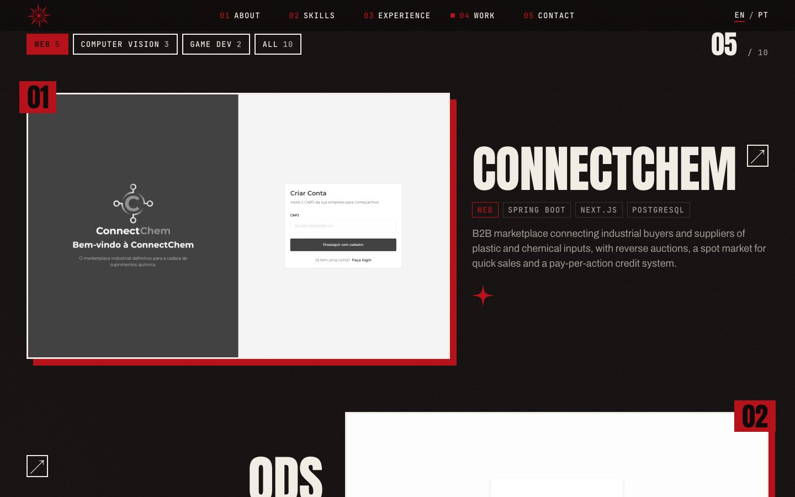</td>
  </tr>
  <tr>
    <td align="center">03 — Experience</td>
    <td align="center">04 — Work</td>
  </tr>
</table>

  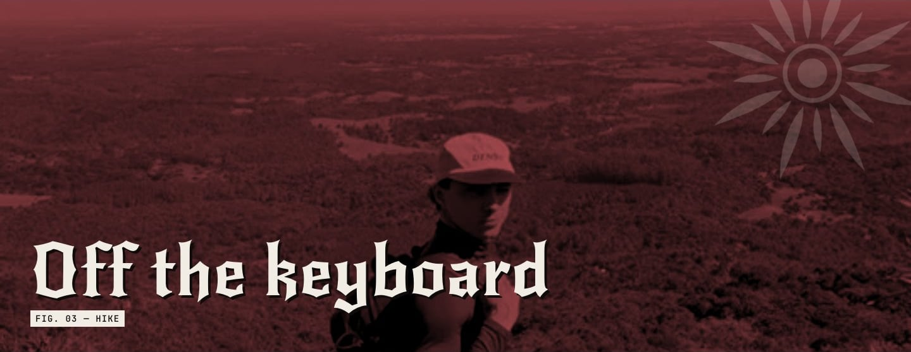

  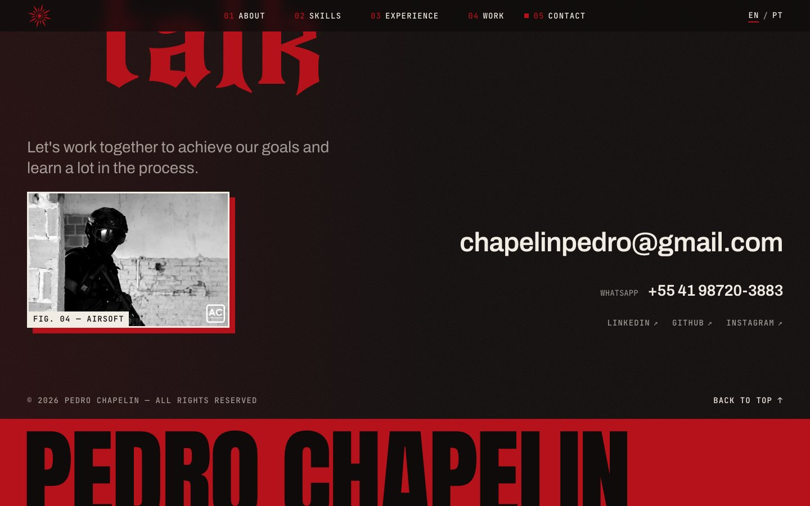
   
  05 — Contact

  

## Mobile

  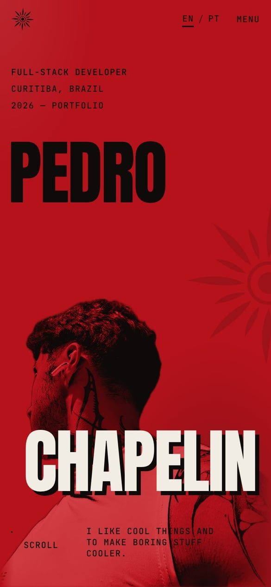
  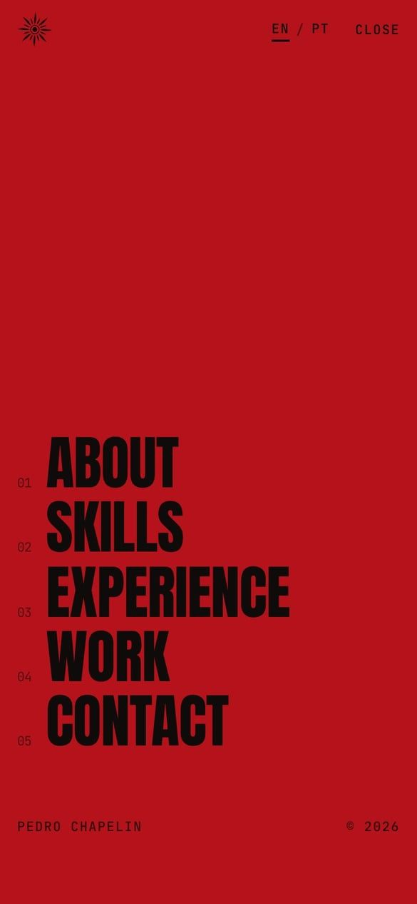
  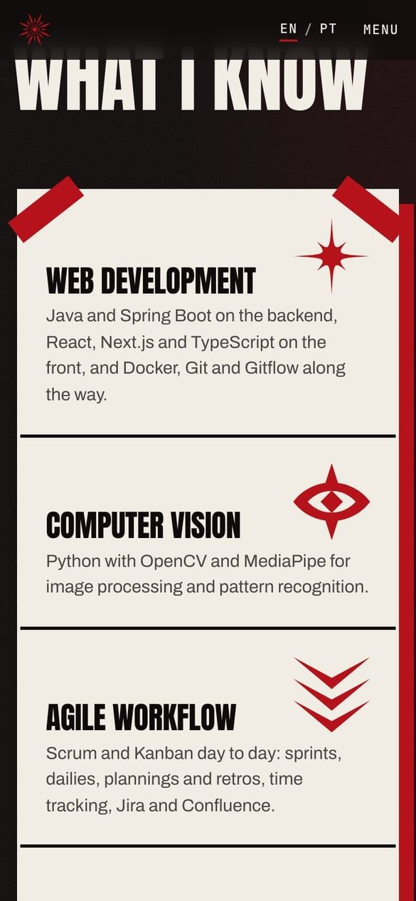
  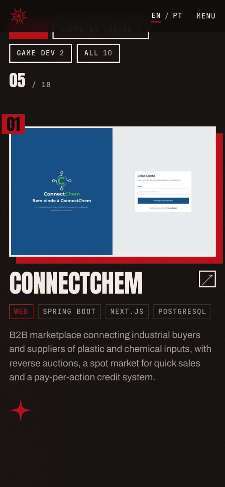

  

## Symbols

Every ornament on the site is an original SVG drawn for this project.

  

  spark · compass · saw · eye · jaw · crown · chevrons · sigil · koru

  Plant images in the Botanical Vault screenshot: <a href="https://pngimg.com">pngimg.com</a> (CC BY-NC 4.0)

